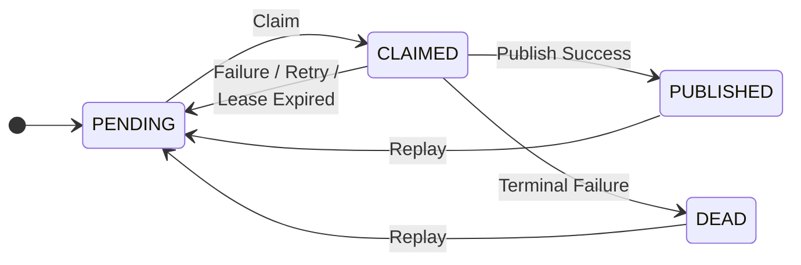

# Processing Lifecycle

## Overview

The processing lifecycle defines how events transition between states during their lifetime.

This section specifies:

- valid state transitions
- relay behavior
- retry and failure handling
- concurrency assumptions

---

## State Machine

---

## States

The lifecycle operates on the following states:

- `PENDING`
- `CLAIMED`
- `PUBLISHED`
- `DEAD`

---

## State Transitions

Valid state transitions are:

- `PENDING` → `CLAIMED`
- `CLAIMED` → `PUBLISHED`
- `CLAIMED` → `PENDING`
- `CLAIMED` → `DEAD`
- `PUBLISHED` → `PENDING` (Replay)
- `DEAD` → `PENDING` (Replay)

Transitions not listed above MUST NOT occur.

---

## Transition Semantics

### PENDING → CLAIMED

- A relay selects an eligible event
- The event MUST be claimed before processing
- `claimed_at` MUST be set to the current time
- `claimed_by` SHOULD be set to the relay identifier
- The event MUST NOT be claimed if it is not eligible (e.g., `available_at` is in the future)

---

### CLAIMED → PUBLISHED

- The relay publishes the event using the publisher
- If the publisher reports success:
  - the event MUST transition to `PUBLISHED`
  - `published_at` MUST be set

---

### CLAIMED → PENDING

- Occurs when a publish attempt fails, cannot be completed, or the claim expires before completion
- The event MUST remain eligible for retry
- `attempts` MUST be incremented
- `last_error` SHOULD be updated
- `available_at` MAY be updated for retry scheduling
- `claimed_at` MUST be cleared (set to null)
- `claimed_by` MUST be cleared (set to null)
- Claim expiration or reaping MAY cause the event to become eligible for reprocessing by another relay

---

### CLAIMED → DEAD

- Occurs when termination conditions are met
- The event MUST transition to `DEAD`
- The event MUST NOT be retried automatically after this transition
- `claimed_at` MUST be cleared
- `claimed_by` MUST be cleared

---

### [Terminal State] → PENDING (Replay)

- Occurs during manual or automated replay operations
- The event returns to a processable state
- Fields like `attempts` or `last_error` MAY be reset based on implementation policy

---

## Claiming

- An event MUST be claimed before it is processed
- Only events in `PENDING` state are eligible for claiming
- Multiple relays MAY operate concurrently
- Under the default processing model, implementations MUST assume that the same event MAY be claimed more than once due to failures or claim expiration.
- Implementations that provide stronger coordination or ordering guarantees MAY prevent duplicate claiming within the documented constraints.

---

## Retry Behavior

- Failed publish attempts MUST result in a retry unless termination conditions are met
- Termination conditions MUST be defined by the implementation and MAY include:
  - maximum number of attempts
  - time-based limits
  - explicit operator intervention
  - implementation-specific policies
- When termination conditions are met, the event MUST transition to `DEAD`

---

## Terminal States

The following states are terminal:

- `PUBLISHED`
- `DEAD`

Once an event reaches a terminal state:

- it MUST NOT transition to another state automatically
- it MAY only be reprocessed through replay mechanisms

---

## Concurrency Model

- Multiple relays MAY process events concurrently
- Under the default processing model:
  - duplicate processing MAY occur
  - a relay SHOULD verify its claim (via `claimed_at` and `claimed_by`) before finalizing a transition to `PUBLISHED`
  - claim conflicts MAY occur
- Implementations that enforce ordering MAY restrict concurrency and prevent duplicate processing within the scope of an ordering key
- The system MUST remain correct under concurrent execution

---

## Failure Scenarios

The system MUST remain correct under the following scenarios:

- relay crashes after claiming an event
- relay crashes after publishing but before state update
- duplicate claims due to timing or failure
- partial failures during publish attempts

In all cases:

- delivery semantics MUST be preserved
- no event MUST be lost once persisted
